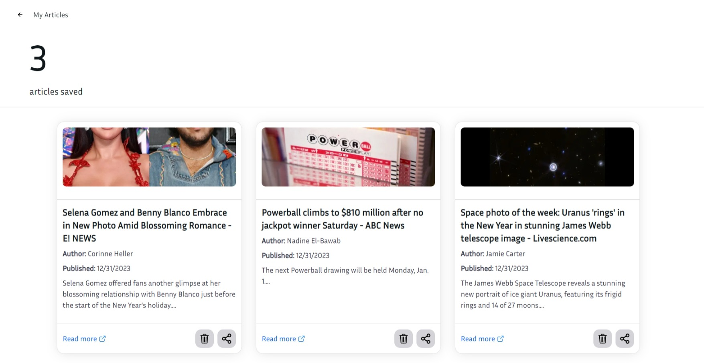
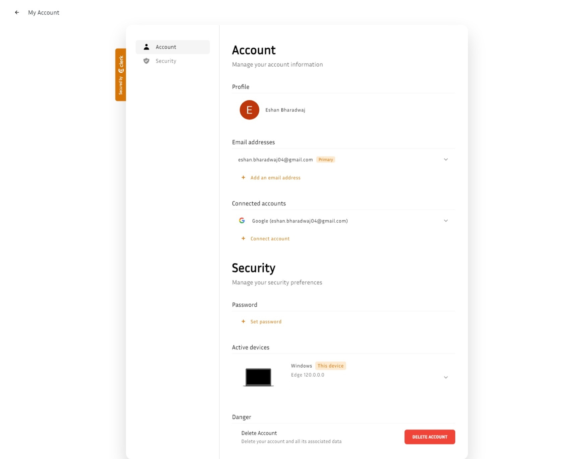

# Sunny Snippets

Sunny Snippets is a positive news web application built with Next.js and Tailwind CSS. It displays uplifting news articles and provides sentiment analysis to filter out articles with negative sentiment scores.

## Screenshots

## Features

- Display positive news articles in a card format.
- Navbar with logo and login section.
- Hero section with a warm welcome to the app.
- Integration with the NewsAPI to fetch real-time news data.
- Sentiment analysis to filter articles based on positivity.

## Technologies Used

<!-- prettier-ignore -->
| Technology | Purpose |
|------------|---------|
|  [Next.js](https://nextjs.org/) | React framework for building web applications |
|  [React](https://reactjs.org/) | JavaScript library for building user interfaces |
|  [Tailwind CSS](https://tailwindcss.com/) | Utility-first CSS framework for styling |
|  [NextUI](https://nextui.org/) | UI library for Tailwind CSS with theming support |
|  [NewsAPI](https://newsapi.org/) | API for fetching news articles |
|  [sentiment](https://www.npmjs.com/package/sentiment) | AFINN sentiment analysis library |
|  [Fetch API](https://developer.mozilla.org/en-US/docs/Web/API/Fetch_API) | Web API for making HTTP requests |
|  [Clerk](https://clerk.com) | Multi-Factor Authentication service |
|  [Firebase](https://firebase.google.com/) | NoSQL database for a serverless backend |

## Contributing

If you have any suggestions, enhancements, or bug fixes, feel free to open an issue or submit a pull request.

## License

This project is licensed under the MIT License - see the [LICENSE](LICENSE) file for details.
